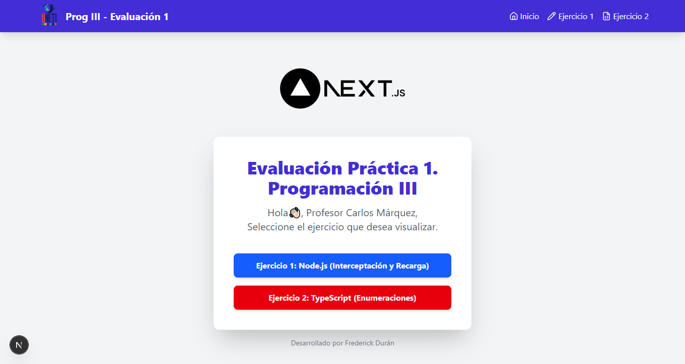
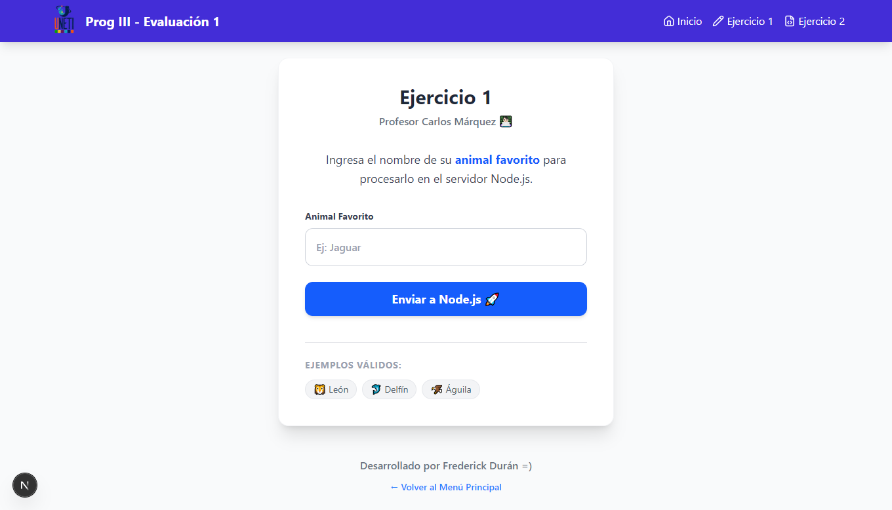
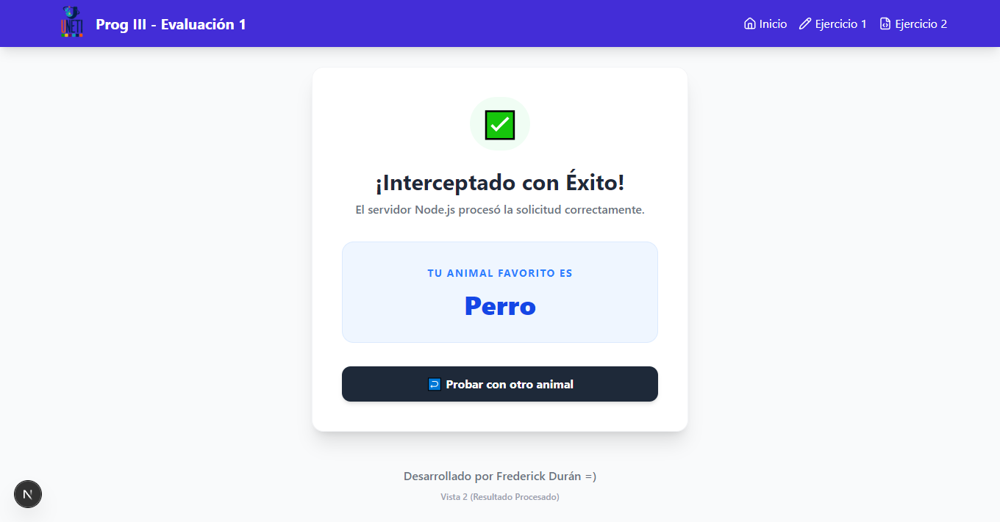
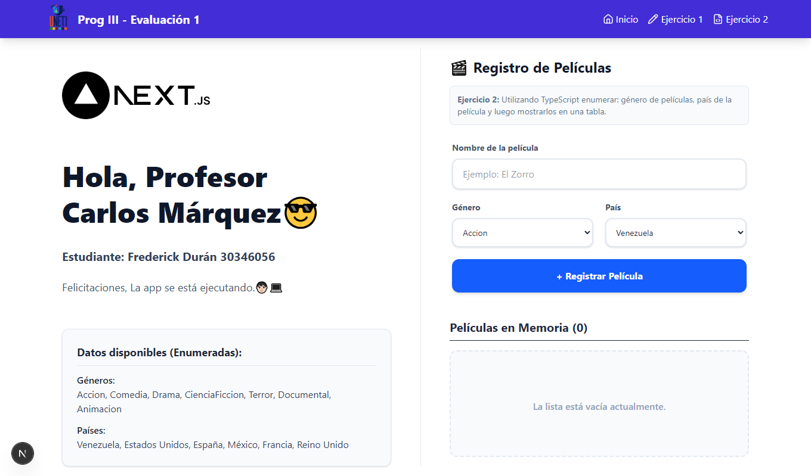

## 👨‍🏫 Docente

-   **Profesor:** Carlos Márquez
-   **Institución:** UNETI

## 👨🏻‍💻 Desarrollado por

-   **Frederick Durán - 30346056**


<div align="center">
  
</div>

<h1 align="center">Evaluación Práctica 1 – Programación III (UNETI – 2025-2)</h1>

Este repositorio contiene el desarrollo de la Evaluación Práctica 1 de la Unidad Curricular Programación III. El proyecto ha sido unificado en una sola aplicación moderna utilizando **Next.js 15**, integrando tanto la lógica del servidor como la del cliente en un mismo entorno robusto y eficiente.

---

## Estructura General del Repositorio

El proyecto utiliza la estructura recomendada de **App Router** de Next.js para buen seguimiento y modularización del código:

```
.
├── src/
│   ├── app/
│   │   ├── api/            # Route Handlers (Backend Serverless)
│   │   ├── ejercicio1/     # Vista del Ejercicio 1 (Formulario)
│   │   ├── ejercicio2/     # Vista del Ejercicio 2 (Lógica Cliente)
│   │   └── page.tsx        # Menú Principal
└── public/                 # Recursos estáticos
```

---

### 🖥️ Vista Principal

<div align="center">
  
</div>

---


## 🚀 Ejercicio 1 – Node.js (Route Handlers)

Este ejercicio demuestra el procesamiento de datos del lado del servidor utilizando **Next.js Route Handlers**, eliminando la necesidad de un servidor Express separado.

### 📝 Descripción
El usuario ingresa su animal favorito en un formulario HTML. Al enviarlo, los datos son interceptados por una ruta de API (`/api/ejercicio1`), que procesa la solicitud (POST) y retorna una respuesta dinámica, simulando el comportamiento de un backend tradicional pero con arquitectura moderna.

### 🛠️ Tecnologías
-   **Next.js API Routes:** Manejo de solicitudes HTTP (GET, POST).
-   **Server-Side Logic:** Procesamiento de formularios en el servidor.
-   **HTML Forms:** Interacción nativa sin JavaScript del lado del cliente.

### 📸 Capturas de Pantalla

<div align="center">
  <table>
    <tr>
      <td align="center"><strong>Formulario de Entrada</strong></td>
      <td align="center"><strong>Resultado</strong></td>
    </tr>
    <tr>
      <td align="center"></td>
      <td align="center"></td>
    </tr>
  </table>
</div>

---

## 🔬 Ejercicio 2 – TypeScript + React Hooks

Este ejercicio se enfoca en la interactividad del lado del cliente, utilizando el poder de React y el tipado estático de TypeScript.

### 📝 Descripción
Una aplicación "Single Page" que permite gestionar una lista de películas. Implementa:
1.  **Enumeraciones (Enums):** Para clasificar estrictamente géneros y países.
2.  **Persistencia:** Uso de `localStorage` para guardar los datos en el navegador.
3.  **Validaciones:** Prevención de duplicados y campos vacíos.
4.  **UI Dinámica:** Listado coloreado según el género de la película.

### 🛠️ Tecnologías
-   **TypeScript Enums:** Tipado fuerte para datos categóricos.
-   **React Hooks:** `useState` para gestión de estado y `useEffect` para el ciclo de vida y persistencia.
-   **Client Components:** Renderizado interactivo en el navegador.

### 📸 Capturas de Pantalla

<div align="center">
  <table>
    <tr>
      <td align="center"><strong>Gestión de Películas</strong></td>
      <td align="center"><strong>Listado de Resultados</strong></td>
    </tr>
    <tr>
      <td align="center"></td>
      <td align="center"></td>
    </tr>
  </table>
</div>

---

## 🛠️ Stack Tecnológico Completo

El proyecto ha sido modernizado dejando atrás EJS y Express puros para utilizar un stack de última generación:

-   **Framework:** [Next.js 15](https://nextjs.org/) (App Router)
-   **Lenguaje:** [TypeScript](https://www.typescriptlang.org/)
-   **Estilos:** [Tailwind CSS](https://tailwindcss.com/)
-   **Iconos:** [Lucide React](https://lucide.dev/)
-   **Linting:** ESLint

---

## 📋 Requisitos Previos (Antes de Iniciar)

Para que el proyecto funcione correctamente en su computador Profesor Carlos, asegúrese de tener instalado:

1.  **Node.js**:
    *   Se recomienda la versión **v18.17.0** o superior (Next.js 15 requiere versiones modernas).
    *   Puede verificar su versión ejecutando: `node -v` en su terminal.
2.  **NPM**:
    *   Generalmente viene instalado con Node.js.

> **Nota para el Profesor:** No es necesario instalar Next.js de forma global en su PC. Todas las dependencias necesarias se instalarán localmente dentro de la carpeta del proyecto al ejecutar `npm install`.

---

## ¿Qué es la carpeta `.next`?

Cuando ejecute el proyecto, notará que se crea automáticamente una carpeta llamada `.next`.

*   **¿Qué contiene?**: Es el resultado de la compilación del proyecto. Next.js toma todo nuestro código (TypeScript, React) y lo transforma en código ultra-optimizado que el navegador puede entender.
*   **Importante**: Esta carpeta **NO** se debe modificar manualmente. Si en algún momento tiene problemas de caché o errores extraños, puede borrarla con confianza y al volver a ejecutar `npm run dev`, se generará de nuevo automáticamente.

---


## ⚙️ Instalación y Ejecución

1.  **Instalar dependencias:**
    ```bash
    npm install
    ```

2.  **Ejecutar el servidor de desarrollo:**
    ```bash
    npm run dev
    ```

3.  **Abrir la aplicación:**
    Visita `http://localhost:3000` en el navegador.


